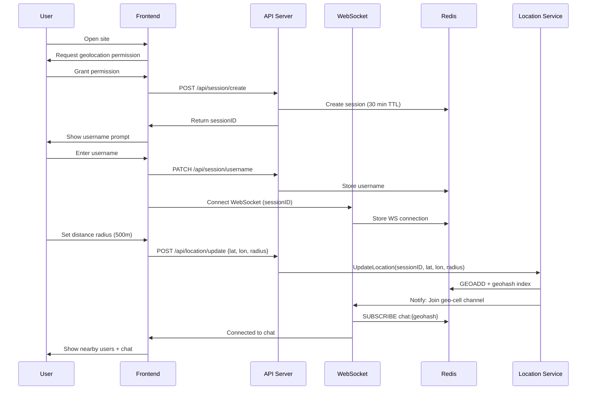
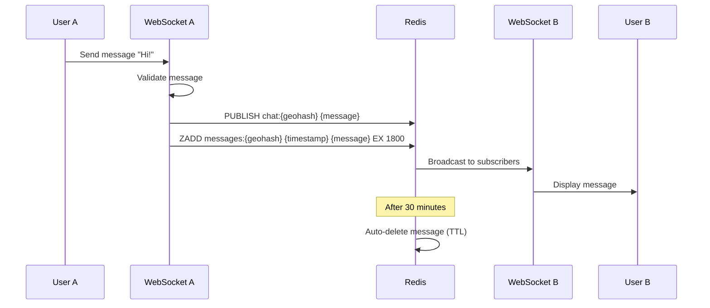
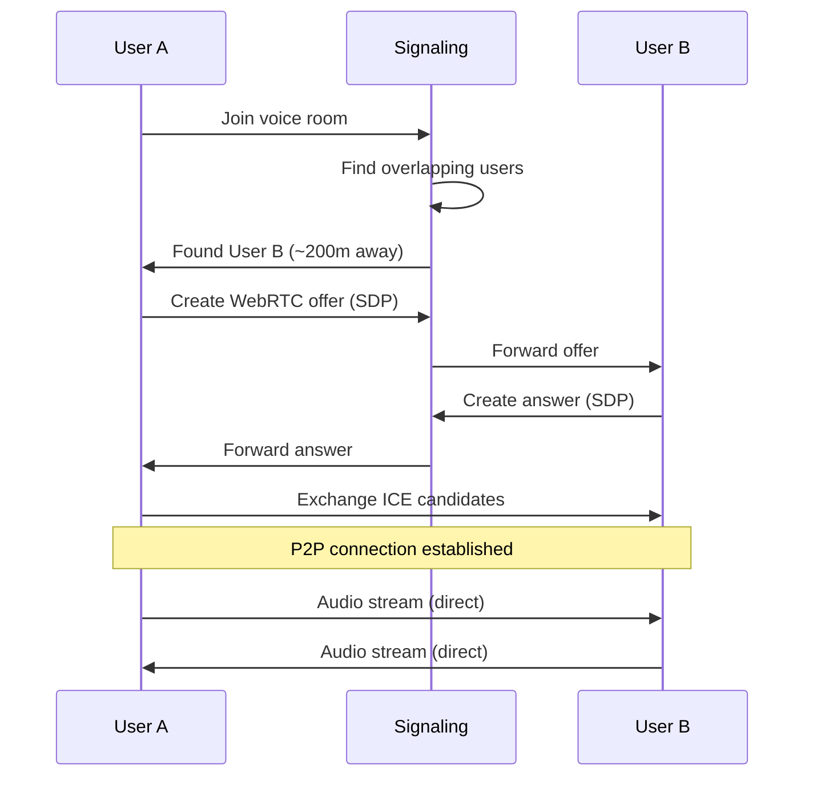
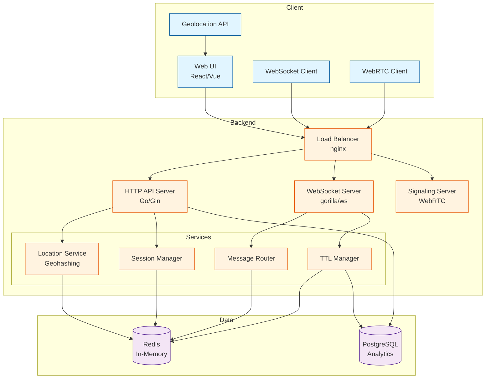
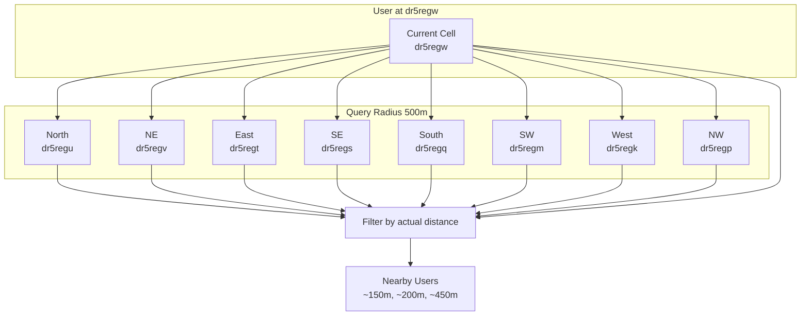

# NearTalk - Technical Architecture Document

## 🎯 Project Overview

**NearTalk** is a proximity-based, anonymous chat and voice platform that allows people in physical proximity to connect and communicate in real-time without accounts or persistent data storage.

### Core Features
- Anonymous, no-signup access
- Distance-based discovery (100m - 2km radius)
- Group chat with auto-expiring messages (30 min TTL)
- Voice rooms with overlapping proximity circles
- Username changes (2-3 times limit)
- Privacy-preserving distance display (approximate, not exact location)

---

## 🏗️ System Architecture

### High-Level Architecture

```
┌─────────────────────────────────────────────────────────────┐
│                        CLIENT LAYER                          │
│  ┌──────────────────────────────────────────────────────┐   │
│  │  Web App (React/Vue + Tailwind)                      │   │
│  │  - Geolocation API                                   │   │
│  │  - WebSocket Client (chat)                           │   │
│  │  - WebRTC Client (voice P2P)                         │   │
│  └──────────────────────────────────────────────────────┘   │
└─────────────────────────────────────────────────────────────┘
                            │
                            ↓
┌─────────────────────────────────────────────────────────────┐
│                      LOAD BALANCER                           │
│                    (nginx/Caddy/Traefik)                     │
└─────────────────────────────────────────────────────────────┘
                            │
                            ↓
┌─────────────────────────────────────────────────────────────┐
│                     BACKEND LAYER (Go)                       │
│  ┌──────────────┐  ┌──────────────┐  ┌──────────────┐     │
│  │   HTTP API   │  │  WebSocket   │  │   Signaling  │     │
│  │   Server     │  │    Server    │  │    Server    │     │
│  │  (Gin/Fiber)│  │  (gorilla/ws)│  │   (WebRTC)   │     │
│  └──────────────┘  └──────────────┘  └──────────────┘     │
│                            │                                 │
│  ┌──────────────────────────────────────────────────────┐  │
│  │         Core Services (Go packages)                   │  │
│  │  - Location Service (geohashing)                     │  │
│  │  - Session Manager (in-memory)                       │  │
│  │  - Message Router (proximity-based)                  │  │
│  │  - TTL Manager (cleanup goroutines)                  │  │
│  └──────────────────────────────────────────────────────┘  │
└─────────────────────────────────────────────────────────────┘
                            │
                            ↓
┌─────────────────────────────────────────────────────────────┐
│                    DATA LAYER (Minimal)                      │
│  ┌──────────────┐                    ┌──────────────┐      │
│  │    Redis     │                    │  PostgreSQL  │      │
│  │  (In-Memory) │                    │  (Minimal)   │      │
│  │  - Sessions  │                    │  - Rate Limit│      │
│  │  - Geohashes │                    │  - Analytics │      │
│  │  - Messages  │                    │              │      │
│  └──────────────┘                    └──────────────┘      │
└─────────────────────────────────────────────────────────────┘
```

---

## 🔧 Component Deep Dive

### 1. Client Layer

#### Web Application
- **Framework**: React or Vue.js with TypeScript
- **Styling**: Tailwind CSS
- **Key Components**:
  - Distance slider (100m - 2km)
  - Chat window (left split)
  - Voice room UI (right split)
  - User list with approximate distances
  
#### Client-Side Logic
- Geolocation API for coordinates (with user permission)
- WebSocket connection for real-time chat
- WebRTC for peer-to-peer voice (with TURN/STUN fallback)
- Local state management (username, session ID, radius)

---

### 2. Backend Layer (Golang)

#### 2.1 HTTP API Server
**Framework**: Gin or Fiber (lightweight, fast)

**Endpoints**:
```
POST   /api/session/create          # Generate session ID
PATCH  /api/session/username        # Update username (rate-limited)
POST   /api/location/update         # Update user location
GET    /api/nearby                  # Get nearby users count
GET    /api/health                  # Health check
```

**Responsibilities**:
- Session ID generation (UUID v4)
- Rate limiting (username changes, API calls)
- Input validation
- CORS handling

#### 2.2 WebSocket Server
**Library**: gorilla/websocket

**Connection Flow**:
```
Client connects → Authenticate session → 
Subscribe to geo-cells → Receive/Send messages → 
Auto-disconnect on inactivity
```

**Features**:
- Connection pooling per geohash cell
- Broadcast to proximity groups
- Message TTL tracking (30 min)
- Heartbeat/ping-pong for connection health

#### 2.3 WebRTC Signaling Server
**Purpose**: Coordinate P2P voice connections

**Signaling Flow**:
```
User A joins voice → Server finds overlapping users → 
Exchange SDP offers/answers → Establish P2P connection →
Audio streams directly between peers
```

**No audio routing through server** - pure P2P after signaling

---

### 3. Core Services (Go Packages)

#### 3.1 Location Service
**Purpose**: Manage user positions and proximity queries

```go
type LocationService struct {
    // Geohash precision: ~150m for precision 7
    geohashIndex map[string][]string // geohash -> [sessionIDs]
    userLocations map[string]Location // sessionID -> Location
    mutex sync.RWMutex
}

type Location struct {
    Lat       float64
    Lon       float64
    Radius    int      // User's selected radius
    Geohash   string
    UpdatedAt time.Time
}
```

**Key Operations**:
- `UpdateLocation(sessionID, lat, lon, radius)`: Update user position
- `GetNearbyUsers(sessionID)`: Return users within radius
- `GetApproximateDistance(sessionID1, sessionID2)`: Calculate distance (rounded to nearest 50m for privacy)
- Background cleanup: Remove stale locations (>5 min inactive)

**Geohashing Strategy**:
- Precision 7 geohash (~153m x 153m cells)
- Query neighboring cells for broader radius
- Efficient spatial indexing without heavy DB queries

#### 3.2 Session Manager
**Purpose**: Manage anonymous user sessions

```go
type Session struct {
    ID              string
    Username        string
    UsernameChanges int
    CreatedAt       time.Time
    LastSeen        time.Time
    WSConnection    *websocket.Conn
}
```

**Features**:
- In-memory session storage (Redis fallback for multi-server)
- TTL-based expiration (30 min inactivity)
- Username change tracking (max 2-3 changes)

#### 3.3 Message Router
**Purpose**: Route messages to correct proximity groups

```go
type Message struct {
    ID        string
    SenderID  string
    Username  string
    Content   string
    Location  string // Geohash (not exact coords)
    Timestamp time.Time
    TTL       time.Time // 30 min from creation
}
```

**Routing Logic**:
1. Receive message from sender
2. Lookup sender's geohash and radius
3. Find all users in overlapping geohashes
4. Broadcast to their WebSocket connections
5. Store in Redis with 30-min TTL

#### 3.4 TTL Manager
**Purpose**: Auto-cleanup expired messages

```go
// Background goroutine
func (m *TTLManager) Start() {
    ticker := time.NewTicker(1 * time.Minute)
    for range ticker.C {
        m.cleanupExpiredMessages()
        m.cleanupInactiveSessions()
    }
}
```

---

## 💾 Data Storage Strategy

### Redis (Primary In-Memory Store)
**Why Redis?**
- Extremely fast (in-memory)
- Built-in TTL support (auto-expiration)
- Pub/Sub for real-time events
- Geospatial commands (GEOADD, GEORADIUS)

**Data Structures**:
```
# Sessions (30 min TTL)
SET session:{sessionID} {sessionData} EX 1800

# User Locations (5 min TTL - refreshed on activity)
GEOADD locations {lon} {lat} {sessionID}
GEORADIUS locations {lon} {lat} {radius}m

# Messages (30 min TTL)
ZADD messages:{geohash} {timestamp} {messageJSON}
ZREMRANGEBYSCORE messages:{geohash} -inf {30minsAgo}

# Active geohashes (for cleanup)
SADD active_cells {geohash}

# Username change counter
HINCRBY session:{sessionID}:meta username_changes 1
```

### PostgreSQL (Minimal, Optional)
**Use Cases**:
- Analytics (aggregated, not real-time)
- Rate limiting counters (abuse prevention)
- Ban list (if moderation needed)

**NOT USED FOR**:
- Real-time message storage
- User sessions
- Location data

---

## 🌐 Proximity Algorithm

### Geohash-Based Proximity Matching

#### Step 1: Convert Location to Geohash
```
User at (lat: 40.7128, lon: -74.0060) with 500m radius
→ Geohash (precision 7): "dr5regw"
```

#### Step 2: Query Neighboring Cells
For a given radius, query:
- Current cell
- 8 neighboring cells (N, NE, E, SE, S, SW, W, NW)

```
Current: dr5regw
Neighbors: dr5regu, dr5regv, dr5regt, dr5regs, dr5regq, ...
```

#### Step 3: Filter by Actual Distance
```go
func GetNearbyUsers(sessionID string) []NearbyUser {
    userLoc := getLocation(sessionID)
    geohashes := getNeighboringGeohashes(userLoc.Geohash, userLoc.Radius)
    
    candidates := []User{}
    for _, gh := range geohashes {
        candidates = append(candidates, getUsersInGeohash(gh)...)
    }
    
    nearby := []NearbyUser{}
    for _, candidate := range candidates {
        distance := haversineDistance(userLoc, candidate.Location)
        if distance <= userLoc.Radius {
            // Round distance for privacy (e.g., nearest 50m)
            approxDist := roundToNearest50(distance)
            nearby = append(nearby, NearbyUser{
                ID: candidate.ID,
                Username: candidate.Username,
                Distance: approxDist, // e.g., "~150m"
            })
        }
    }
    return nearby
}
```

#### Distance Privacy
- Never send exact coordinates to clients
- Round distances (50m, 100m, 150m, 200m, etc.)
- Display as ranges: "100-150m away"

---

## 🎙️ Voice Connection Architecture

### WebRTC P2P Flow

```
User A                  Signaling Server               User B
  │                            │                          │
  │ 1. Join voice room         │                          │
  ├────────────────────────────>                          │
  │                            │                          │
  │ 2. Find overlapping users  │                          │
  │<────────────────────────────                          │
  │                            │                          │
  │ 3. Create offer (SDP)      │                          │
  ├────────────────────────────>                          │
  │                            │ 4. Forward offer         │
  │                            ├──────────────────────────>
  │                            │                          │
  │                            │ 5. Create answer (SDP)   │
  │                            │<─────────────────────────┤
  │ 6. Forward answer          │                          │
  │<────────────────────────────                          │
  │                            │                          │
  │ 7. Exchange ICE candidates │                          │
  │<────────────────────────────────────────────────────>│
  │                            │                          │
  │ 8. P2P connection established (audio streams)        │
  │<═══════════════════════════════════════════════════>│
  │            (no server involvement)                    │
```

### TURN/STUN Servers
For NAT traversal when direct P2P fails:
- **STUN**: Public server to discover public IP
- **TURN**: Relay server as fallback (coturn, hosted)

**Recommendation**: Use free TURN services initially:
- Google STUN servers
- Twilio's STUN/TURN (free tier)
- Self-hosted coturn later

---

## 📊 Scalability Considerations

### Horizontal Scaling Strategy

#### Challenge: WebSocket Sticky Sessions
- Each user maintains WebSocket connection to specific server
- Messages must route across servers

#### Solution 1: Redis Pub/Sub
```
Server 1                    Redis Pub/Sub                Server 2
   │                              │                           │
   │ User A sends message         │                           │
   ├──────────────────────────────>                           │
   │ PUBLISH chat:{geohash}       │                           │
   │                              ├───────────────────────────>
   │                              │ Forward to User B         │
   │                              │                           │
```

Each server:
1. Subscribes to geohash channels
2. Publishes messages to Redis
3. Redis broadcasts to all subscribed servers
4. Servers forward to their connected clients

#### Solution 2: Message Queue (RabbitMQ/NATS)
For even higher scale:
- Topic-based routing (geo-cells as topics)
- Better durability
- More complex setup

### Vertical Scaling (Single Server)
**Capacity Estimate**:
- Go handles ~10,000 concurrent WebSocket connections per server
- Redis: ~100,000 ops/sec on modest hardware
- For MVP: Single server + Redis = 5,000-10,000 concurrent users

### Database Scaling
**Avoid heavy DB usage**:
- Redis handles 99% of operations
- PostgreSQL only for analytics (async writes)
- No real-time DB queries

---

## 🔒 Security & Privacy

### Privacy Protections

#### 1. Location Privacy
```go
// DON'T: Send exact coordinates
{
    "lat": 40.712776,
    "lon": -74.005974
}

// DO: Send rounded distance and geohash prefix
{
    "distance": "~150m",
    "geohash_prefix": "dr5r" // First 4 chars only
}
```

#### 2. Anonymous Sessions
- No email, phone, or identifying info
- Session IDs: cryptographically random UUIDs
- No IP address storage (use in-memory only)

#### 3. Message Ephemerality
- Hard 30-minute TTL (enforced in Redis)
- No backups, no archives
- Background cleanup every minute

### Security Measures

#### 1. Rate Limiting
```go
// Per session rate limits
type RateLimits struct {
    Messages     int // 10 messages per minute
    UsernameChange int // 3 changes per session
    LocationUpdate int // 1 per 10 seconds
}
```

#### 2. Input Validation
- Username: 3-20 chars, alphanumeric + spaces
- Message: Max 500 chars
- Coordinates: Valid lat/lon ranges
- Radius: 100m - 2km only

#### 3. WebSocket Security
- Origin checking (CORS)
- Rate limit connections per IP
- Heartbeat/timeout (disconnect inactive)

#### 4. Content Moderation (Future)
- Keyword filtering (profanity, spam)
- Report mechanism (flagged users auto-disconnect)
- IP-based temporary bans

---

## 🚀 Deployment Architecture

### Recommended Stack

```
┌──────────────────────────────────────┐
│  Cloudflare (CDN + DDoS Protection)  │
└──────────────────────────────────────┘
              │
              ↓
┌──────────────────────────────────────┐
│   nginx/Caddy (Reverse Proxy + TLS)  │
└──────────────────────────────────────┘
              │
              ↓
┌──────────────────────────────────────┐
│   Go Backend (Docker container)      │
│   - HTTP API: :8080                  │
│   - WebSocket: :8080/ws              │
│   - Signaling: :8080/signal          │
└──────────────────────────────────────┘
              │
              ↓
┌──────────────────────────────────────┐
│   Redis (Docker/Managed Service)     │
│   - Port: 6379                       │
│   - Persistence: Optional            │
└──────────────────────────────────────┘
```

### Hosting Options

#### Option 1: Single VPS (MVP)
**Provider**: DigitalOcean, Linode, Hetzner
**Specs**: 
- 2 CPU, 4GB RAM ($20-40/month)
- Docker Compose setup
- Redis on same machine

#### Option 2: Managed (Scale)
**Backend**: 
- Railway.app or Render.com (easy Go deployment)
- Auto-scaling, built-in load balancing

**Redis**: 
- Redis Cloud (free tier: 30MB)
- Upstash (serverless Redis)

### Monitoring
- **Metrics**: Prometheus + Grafana
  - WebSocket connections
  - Message throughput
  - Redis ops/sec
  - Active geohashes
- **Logging**: Structured logs (zerolog)
- **Alerts**: High latency, connection drops

---

## 📋 Development Phases

### Phase 1: MVP (2-3 weeks)
**Goal**: Basic chat working locally

- [ ] Frontend: Distance slider + chat UI
- [ ] Backend: HTTP API + WebSocket server
- [ ] Location service: Geohash-based proximity
- [ ] Redis integration: Sessions + messages
- [ ] Message TTL cleanup
- [ ] Deploy to single VPS

### Phase 2: Voice (1-2 weeks)
**Goal**: Add voice rooms

- [ ] WebRTC signaling server
- [ ] STUN/TURN integration
- [ ] Voice room UI
- [ ] Peer discovery

### Phase 3: Polish (1 week)
**Goal**: UX improvements

- [ ] Username change limits
- [ ] Better error handling
- [ ] Loading states
- [ ] Mobile responsive

### Phase 4: Scale (2 weeks)
**Goal**: Handle 1,000+ concurrent users

- [ ] Redis Pub/Sub for multi-server
- [ ] Load balancer setup
- [ ] Monitoring dashboard
- [ ] Performance testing

---

## 🧪 Testing Strategy

### Load Testing
**Tool**: k6 (Grafana k6)

```javascript
// Simulate 1000 concurrent users
export default function() {
    ws.connect('ws://localhost:8080/ws', function(socket) {
        socket.on('open', function() {
            socket.send(JSON.stringify({
                type: 'message',
                content: 'Hello world'
            }));
        });
    });
}
```

### Geographic Testing
- Test with users at varying distances
- Edge cases: Exactly at radius boundary
- Movement: Users entering/leaving radius

---

## 🛠️ Technology Stack Summary

| Layer | Technology | Reason |
|-------|-----------|---------|
| **Frontend** | React + TypeScript | Type safety, component reusability |
| **Styling** | Tailwind CSS | Rapid UI development |
| **Backend** | Go (Golang) | High performance, excellent concurrency |
| **Web Framework** | Gin or Fiber | Lightweight, fast HTTP handling |
| **WebSockets** | gorilla/websocket | Mature, well-supported |
| **Database** | Redis (primary) | In-memory speed, TTL support |
| **Database** | PostgreSQL (minimal) | Analytics only |
| **Voice** | WebRTC | P2P, no server bandwidth |
| **Signaling** | Custom Go server | Full control |
| **Geospatial** | Geohash | Efficient proximity queries |
| **Deployment** | Docker + Docker Compose | Easy deployment, reproducibility |
| **Hosting** | VPS → Managed service | Scale as needed |

---

## 📐 Mermaid Diagrams

### User Connection Flow


### Message Flow


### Voice Connection Flow


### System Component Diagram


### Geohash Proximity Diagram


---

## 🎯 Key Takeaways

### Why This Architecture Works

1. **Minimal Database**: Redis handles 99% of operations, avoiding DB bottlenecks
2. **Ephemeral by Design**: TTL everywhere = automatic cleanup, no data bloat
3. **Geohashing**: Fast spatial queries without complex geo-databases
4. **WebSockets**: Real-time, bidirectional communication
5. **P2P Voice**: No bandwidth costs for voice (WebRTC direct connections)
6. **Go Concurrency**: Goroutines handle thousands of connections efficiently
7. **Stateless API**: Easy to scale horizontally

### Trade-offs

| Decision | Benefit | Trade-off |
|----------|---------|-----------|
| No user accounts | Privacy, simplicity | No persistent identity |
| 30-min message TTL | Low storage costs | No history |
| Geohash precision 7 | Fast queries | ~150m granularity |
| P2P voice | No bandwidth costs | Requires TURN fallback |
| Redis primary | Blazing fast | Data lost on crash (acceptable) |

---

## 🚦 Next Steps

1. **Set up Go project structure**
   ```
   NearTalk/
   ├── cmd/
   │   └── server/
   │       └── main.go
   ├── internal/
   │   ├── api/
   │   ├── websocket/
   │   ├── location/
   │   ├── session/
   │   └── models/
   ├── pkg/
   ├── web/
   │   └── (frontend code)
   ├── docker-compose.yml
   └── go.mod
   ```

2. **Bootstrap frontend**
   - Create React app with TypeScript
   - Set up Tailwind CSS
   - Build basic UI components

3. **Start with core backend**
   - HTTP API server (session creation)
   - WebSocket server (basic chat)
   - Redis integration

4. **Add location logic**
   - Geohashing library (github.com/mmcloughlin/geohash)
   - Proximity queries
   - Distance calculations

5. **Iterate and test**
   - Local testing with multiple browser tabs
   - Deploy MVP to VPS
   - Gather feedback

---

**This architecture is designed for rapid iteration while maintaining scalability paths for the future. Start simple, measure performance, and scale components as needed.**