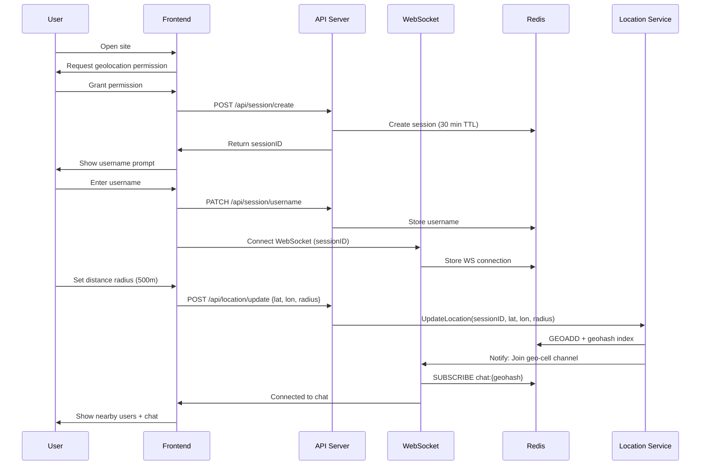
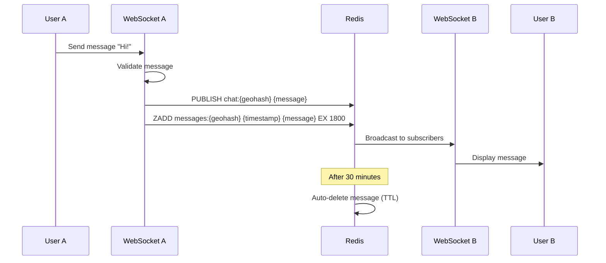
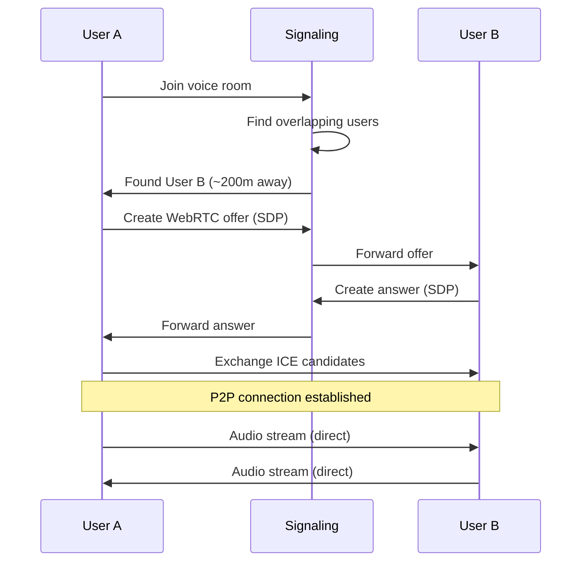
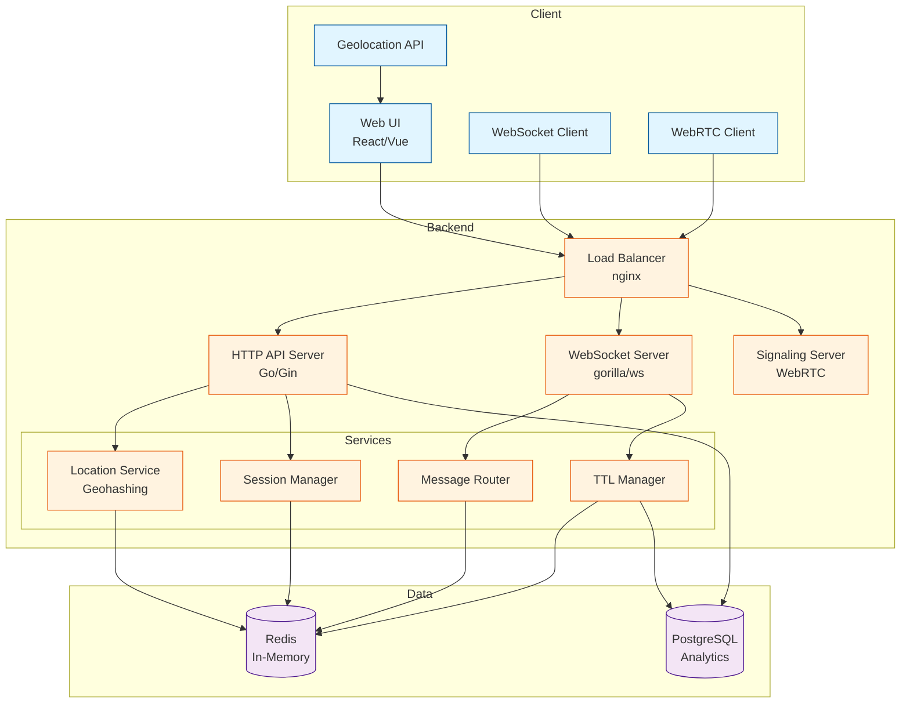
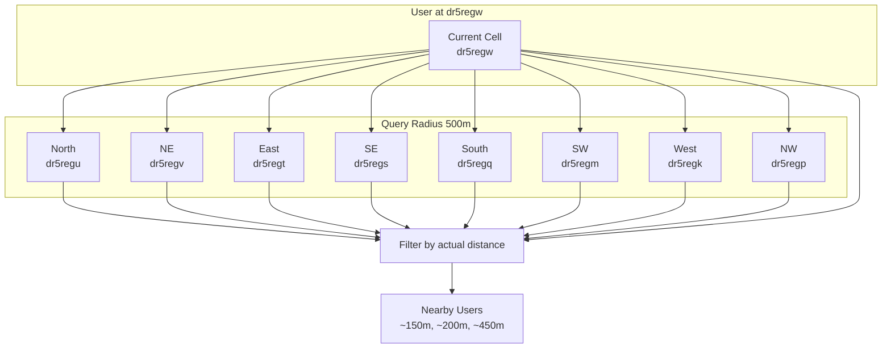

# NearTalk - Technical Architecture Document

**NearTalk** is a proximity-based, anonymous chat and voice platform that allows people in physical proximity to connect and communicate in real-time without accounts or persistent data storage.

### Core Features
- Anonymous, no-signup access
- Distance-based discovery (100m - 2km radius)
- Group chat with auto-expiring messages (30 min TTL)
- Voice rooms with overlapping proximity circles
- Username changes (2-3 times limit)
- Privacy-preserving distance display (approximate, not exact location)

---

## 🏗️ System Architecture

### High-Level Architecture

```
┌─────────────────────────────────────────────────────────────┐
│                        CLIENT LAYER                          │
│  ┌──────────────────────────────────────────────────────┐   │
│  │  Web App (React/Vue + Tailwind)                      │   │
│  │  - Geolocation API                                   │   │
│  │  - WebSocket Client (chat)                           │   │
│  │  - WebRTC Client (voice P2P)                         │   │
│  └──────────────────────────────────────────────────────┘   │
└─────────────────────────────────────────────────────────────┘
                            │
                            ↓
┌─────────────────────────────────────────────────────────────┐
│                      LOAD BALANCER                           │
│                    (nginx/Caddy/Traefik)                     │
└─────────────────────────────────────────────────────────────┘
                            │
                            ↓
┌─────────────────────────────────────────────────────────────┐
│                     BACKEND LAYER (Go)                       │
│  ┌──────────────┐  ┌──────────────┐  ┌──────────────┐     │
│  │   HTTP API   │  │  WebSocket   │  │   Signaling  │     │
│  │   Server     │  │    Server    │  │    Server    │     │
│  │  (Gin/Fiber)│  │  (gorilla/ws)│  │   (WebRTC)   │     │
│  └──────────────┘  └──────────────┘  └──────────────┘     │
│                            │                                 │
│  ┌──────────────────────────────────────────────────────┐  │
│  │         Core Services (Go packages)                   │  │
│  │  - Location Service (geohashing)                     │  │
│  │  - Session Manager (in-memory)                       │  │
│  │  - Message Router (proximity-based)                  │  │
│  │  - TTL Manager (cleanup goroutines)                  │  │
│  └──────────────────────────────────────────────────────┘  │
└─────────────────────────────────────────────────────────────┘
                            │
                            ↓
┌─────────────────────────────────────────────────────────────┐
│                    DATA LAYER (Minimal)                      │
│  ┌──────────────┐                    ┌──────────────┐      │
│  │    Redis     │                    │  PostgreSQL  │      │
│  │  (In-Memory) │                    │  (Minimal)   │      │
│  │  - Sessions  │                    │  - Rate Limit│      │
│  │  - Geohashes │                    │  - Analytics │      │
│  │  - Messages  │                    │              │      │
│  └──────────────┘                    └──────────────┘      │
└─────────────────────────────────────────────────────────────┘
```


**Signaling Flow**:
```
User A joins voice → Server finds overlapping users → 
Exchange SDP offers/answers → Establish P2P connection →
Audio streams directly between peers
```

**No audio routing through server** - pure P2P after signaling

**Geohashing Strategy**:
- Precision 7 geohash (~153m x 153m cells)
- Query neighboring cells for broader radius

**Features**:
- In-memory session storage (Redis fallback for multi-server)
- TTL-based expiration (30 min inactivity)
- Username change tracking (max 2-3 changes)


## 🎙️ Voice Connection Architecture

### WebRTC P2P Flow

```
User A                  Signaling Server               User B
  │                            │                          │
  │ 1. Join voice room         │                          │
  ├────────────────────────────>                          │
  │                            │                          │
  │ 2. Find overlapping users  │                          │
  │<────────────────────────────                          │
  │                            │                          │
  │ 3. Create offer (SDP)      │                          │
  ├────────────────────────────>                          │
  │                            │ 4. Forward offer         │
  │                            ├──────────────────────────>
  │                            │                          │
  │                            │ 5. Create answer (SDP)   │
  │                            │<─────────────────────────┤
  │ 6. Forward answer          │                          │
  │<────────────────────────────                          │
  │                            │                          │
  │ 7. Exchange ICE candidates │                          │
  │<────────────────────────────────────────────────────>│
  │                            │                          │
  │ 8. P2P connection established (audio streams)        │
  │<═══════════════════════════════════════════════════>│
  │            (no server involvement)                    │
```

## Deployment Architecture

```
┌──────────────────────────────────────┐
│  Cloudflare (CDN + DDoS Protection)  │
└──────────────────────────────────────┘
              │
              ↓
┌──────────────────────────────────────┐
│   nginx/Caddy (Reverse Proxy + TLS)  │
└──────────────────────────────────────┘
              │
              ↓
┌──────────────────────────────────────┐
│   Go Backend (Docker container)      │
│   - HTTP API: :8080                  │
│   - WebSocket: :8080/ws              │
│   - Signaling: :8080/signal          │
└──────────────────────────────────────┘
              │
              ↓
┌──────────────────────────────────────┐
│   Redis (Docker/Managed Service)     │
│   - Port: 6379                       │
│   - Persistence: Optional            │
└──────────────────────────────────────┘
```

## Development Phases

### Phase 1: MVP (2-3 weeks)
**Goal**: Basic chat working locally

- [ ] Frontend: Distance slider + chat UI
- [ ] Backend: HTTP API + WebSocket server
- [ ] Location service: Geohash-based proximity
- [ ] Redis integration: Sessions + messages
- [ ] Message TTL cleanup
- [ ] Deploy to single VPS

### Phase 2: Voice (1-2 weeks)
**Goal**: Add voice rooms

- [ ] WebRTC signaling server
- [ ] STUN/TURN integration
- [ ] Voice room UI
- [ ] Peer discovery

### Phase 3: Polish (1 week)
**Goal**: UX improvements

- [ ] Username change limits
- [ ] Better error handling
- [ ] Loading states
- [ ] Mobile responsive

---

## 📐 Mermaid Diagrams

### User Connection Flow


### Message Flow


### Voice Connection Flow


### System Component Diagram


### Geohash Proximity Diagram

