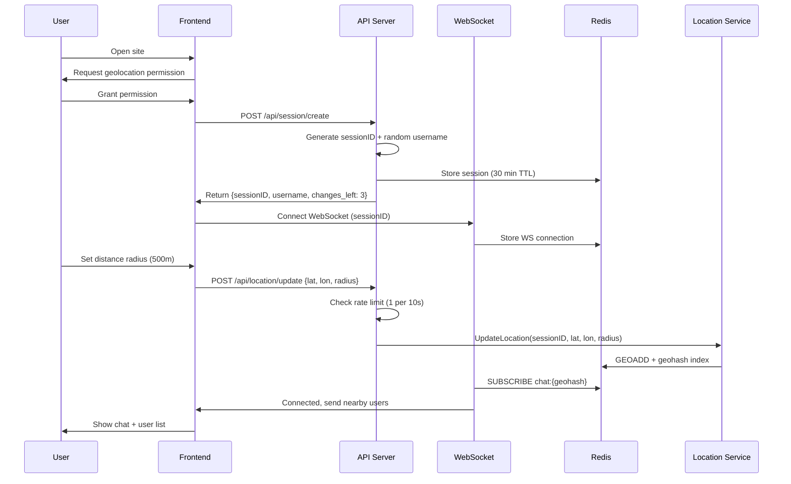
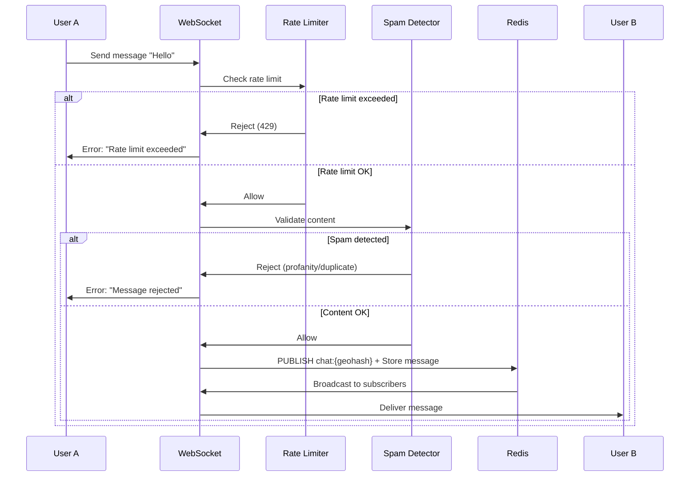

# PeopleAroundMe - Technical Architecture Document

## 🎯 Project Overview

**PeopleAroundMe** is a proximity-based, anonymous text chat platform that allows people in physical proximity to connect and communicate in real-time without accounts or persistent data storage.

### Core Features
- Anonymous, no-signup access
- Distance-based discovery (100m - 2km radius)
- Group chat with auto-expiring messages (30 min TTL)
- Username changes (2-3 times limit per session)
- Privacy-preserving distance display (approximate, not exact location)
- Comprehensive spam protection and rate limiting

---

## 🏗️ System Architecture

### High-Level Architecture

```
┌─────────────────────────────────────────────────────────────┐
│                        CLIENT LAYER                          │
│  ┌──────────────────────────────────────────────────────┐   │
│  │  Web App (React + Tailwind)                          │   │
│  │  - Geolocation API                                   │   │
│  │  - WebSocket Client (chat)                           │   │
│  │  - Distance slider (100m - 2km)                      │   │
│  └──────────────────────────────────────────────────────┘   │
└─────────────────────────────────────────────────────────────┘
                            │
                            ↓
┌─────────────────────────────────────────────────────────────┐
│                      LOAD BALANCER                           │
│                    (nginx/Caddy/Traefik)                     │
└─────────────────────────────────────────────────────────────┘
                            │
                            ↓
┌─────────────────────────────────────────────────────────────┐
│                     BACKEND LAYER (Go)                       │
│  ┌──────────────┐  ┌──────────────┐  ┌──────────────┐     │
│  │   HTTP API   │  │  WebSocket   │  │ Rate Limiter │     │
│  │   Server     │  │    Server    │  │   Middleware │     │
│  │  (Gin)       │  │  (gorilla/ws)│  │              │     │
│  └──────────────┘  └──────────────┘  └──────────────┘     │
│                            │                                 │
│  ┌──────────────────────────────────────────────────────┐  │
│  │         Core Services (Go packages)                   │  │
│  │  - Location Service (geohashing)                     │  │
│  │  - Session Manager (in-memory)                       │  │
│  │  - Message Router (proximity-based)                  │  │
│  │  - TTL Manager (cleanup goroutines)                  │  │
│  │  - Spam Detector (content filtering)                 │  │
│  └──────────────────────────────────────────────────────┘  │
└─────────────────────────────────────────────────────────────┘
                            │
                            ↓
┌─────────────────────────────────────────────────────────────┐
│                    DATA LAYER (Minimal)                      │
│  ┌──────────────┐                    ┌──────────────┐      │
│  │    Redis     │                    │  PostgreSQL  │      │
│  │  (In-Memory) │                    │  (Optional)  │      │
│  │  - Sessions  │                    │  - Analytics │      │
│  │  - Geohashes │                    │  - Ban List  │      │
│  │  - Messages  │                    │              │      │
│  │  - Rate Limits│                   │              │      │
│  └──────────────┘                    └──────────────┘      │
└─────────────────────────────────────────────────────────────┘
```

---

## 🔧 Component Deep Dive

### 1. Client Layer

#### Web Application
- **Framework**: React with TypeScript
- **Styling**: Tailwind CSS
- **Key Components**:
  - Distance slider (100m - 2km)
  - Chat window
  - User list with approximate distances
  - Username editor (with remaining changes counter)
  
#### Client-Side Logic
- Geolocation API for coordinates (with user permission)
- WebSocket connection for real-time chat
- Local state management (username, session ID, radius)
- Reconnection logic with exponential backoff

---

### 2. Backend Layer (Golang)

#### 2.1 HTTP API Server
**Framework**: Gin (lightweight, fast)

**Endpoints**:
```
POST   /api/session/create          # Generate session ID + initial username
PATCH  /api/session/username        # Update username (rate-limited: 3 changes max)
POST   /api/location/update         # Update user location (rate-limited: 1/10s)
GET    /api/nearby                  # Get nearby users count
GET    /api/health                  # Health check
GET    /api/metrics                 # Prometheus metrics (optional)
```

**Responsibilities**:
- Session ID generation (UUID v4)
- Rate limiting enforcement
- Input validation and sanitization
- CORS handling
- Spam detection integration

#### 2.2 WebSocket Server
**Library**: gorilla/websocket

**Connection Flow**:
```
Client connects → Authenticate session → 
Subscribe to geo-cells → Receive/Send messages → 
Auto-disconnect on inactivity
```

**Features**:
- Connection pooling per geohash cell
- Broadcast to proximity groups
- Message TTL tracking (30 min)
- Heartbeat/ping-pong for connection health
- Per-connection rate limiting

**Message Types**:
```json
// Client → Server
{
  "type": "chat_message",
  "content": "Hello world",
  "timestamp": 1234567890
}

{
  "type": "ping",
  "timestamp": 1234567890
}

// Server → Client
{
  "type": "chat_message",
  "id": "msg_123",
  "sender_id": "user_456",
  "username": "CoolUser42",
  "content": "Hello world",
  "distance": "~150m",
  "timestamp": 1234567890
}

{
  "type": "user_joined",
  "username": "NewUser",
  "distance": "~200m",
  "user_count": 5
}

{
  "type": "user_left",
  "username": "OldUser",
  "user_count": 4
}

{
  "type": "pong",
  "timestamp": 1234567890
}

{
  "type": "error",
  "message": "Rate limit exceeded",
  "code": "RATE_LIMIT"
}
```

---

### 3. Core Services (Go Packages)

#### 3.1 Location Service
**Purpose**: Manage user positions and proximity queries

```go
type LocationService struct {
    geohashIndex  map[string][]string      // geohash -> [sessionIDs]
    userLocations map[string]*Location     // sessionID -> Location
    mutex         sync.RWMutex
}

type Location struct {
    SessionID  string
    Lat        float64
    Lon        float64
    Radius     int         // User's selected radius (100-2000m)
    Geohash    string
    UpdatedAt  time.Time
}
```

**Key Operations**:
- `UpdateLocation(sessionID, lat, lon, radius)`: Update user position (rate-limited)
- `GetNearbyUsers(sessionID)`: Return users within radius
- `GetApproximateDistance(sessionID1, sessionID2)`: Calculate distance (rounded to 50m)
- Background cleanup: Remove stale locations (>5 min inactive)

**Geohashing Strategy**:
- Precision 7 geohash (~153m x 153m cells)
- Query neighboring cells for broader radius coverage
- Efficient spatial indexing without heavy DB queries

#### 3.2 Session Manager
**Purpose**: Manage anonymous user sessions

```go
type Session struct {
    ID                  string
    Username            string
    UsernameChangeCount int
    MaxUsernameChanges  int       // Default: 3
    CreatedAt           time.Time
    LastSeen            time.Time
    IPAddress           string    // For rate limiting only
    WSConnection        *websocket.Conn
}
```

**Features**:
- In-memory session storage (Redis for persistence)
- TTL-based expiration (30 min inactivity)
- Username change tracking (max 3 changes)
- Random default username generation ("User1234")

#### 3.3 Message Router
**Purpose**: Route messages to correct proximity groups

```go
type Message struct {
    ID        string
    SenderID  string
    Username  string
    Content   string
    Geohash   string    // Not exposed to clients
    Timestamp time.Time
    ExpiresAt time.Time // 30 min from creation
}
```

**Routing Logic**:
1. Receive message from sender (validate via spam detector)
2. Check sender's rate limit (10 messages/min)
3. Lookup sender's geohash and radius
4. Find all users in overlapping geohashes
5. Calculate approximate distance for each recipient
6. Broadcast to their WebSocket connections
7. Store in Redis with 30-min TTL

#### 3.4 TTL Manager
**Purpose**: Auto-cleanup expired data

```go
type TTLManager struct {
    messageStore  MessageStore
    sessionStore  SessionStore
    locationStore LocationStore
}

func (m *TTLManager) Start(ctx context.Context) {
    ticker := time.NewTicker(1 * time.Minute)
    defer ticker.Stop()
    
    for {
        select {
        case <-ticker.C:
            m.cleanupExpiredMessages()
            m.cleanupInactiveSessions()
            m.cleanupStaleLocations()
        case <-ctx.Done():
            return
        }
    }
}
```

#### 3.5 Spam Detector
**Purpose**: Content filtering and abuse prevention

```go
type SpamDetector struct {
    profanityFilter  *filter.Filter
    messageHistory   map[string][]time.Time // sessionID -> timestamps
    suspiciousWords  []string
    mutex            sync.RWMutex
}

func (s *SpamDetector) ValidateMessage(sessionID, content string) error {
    // Check profanity
    if s.profanityFilter.IsProfane(content) {
        return ErrProfanityDetected
    }
    
    // Check for spam patterns
    if s.isDuplicateSpam(sessionID, content) {
        return ErrSpamDetected
    }
    
    // Check message length
    if len(content) > 500 {
        return ErrMessageTooLong
    }
    
    // Check for URL spam
    if s.hasExcessiveURLs(content) {
        return ErrURLSpam
    }
    
    return nil
}
```

**Spam Detection Features**:
- Profanity filtering (configurable word list)
- Duplicate message detection (same message within 30s)
- URL spam detection (max 2 URLs per message)
- Message length limits (3-500 characters)
- Rapid-fire detection (part of rate limiting)

---

## 💾 Data Storage Strategy

### Redis (Primary In-Memory Store)

**Data Structures**:
```
# Sessions (30 min TTL)
SET session:{sessionID} {sessionData} EX 1800
HSET session:{sessionID}:meta username_changes 0

# User Locations (auto-refresh on activity)
GEOADD locations {lon} {lat} {sessionID}
SET location:{sessionID} {locationData} EX 300

# Messages (30 min TTL)
ZADD messages:{geohash} {timestamp} {messageJSON}
EXPIRE messages:{geohash} 1800

# Rate Limiting (sliding window)
ZADD ratelimit:msg:{sessionID} {timestamp} {timestamp}
EXPIRE ratelimit:msg:{sessionID} 60

ZADD ratelimit:location:{sessionID} {timestamp} {timestamp}
EXPIRE ratelimit:location:{sessionID} 10

INCR ratelimit:username:{sessionID}
EXPIRE ratelimit:username:{sessionID} 86400

# Active WebSocket connections (for tracking)
SADD ws:active {sessionID}

# Spam detection (duplicate message cache)
SET spam:msg:{hash} 1 EX 30

# IP-based rate limiting (abuse prevention)
INCR ratelimit:ip:{ip}:sessions EX 3600
ZADD ratelimit:ip:{ip}:requests {timestamp} {timestamp}
EXPIRE ratelimit:ip:{ip}:requests 60
```

### PostgreSQL (Optional, Minimal)
**Use Cases**:
- Analytics (aggregated data, not real-time)
- Permanent ban list (extreme abuse cases)
- Long-term metrics

**NOT USED FOR**:
- Real-time message storage
- User sessions
- Location data
- Rate limiting

---

## 🛡️ Rate Limiting & Spam Protection

### Multi-Layer Rate Limiting

#### Layer 1: Per-Session Limits
```go
type RateLimits struct {
    // Chat messages
    MessagesPerMinute      int // 10 messages/min
    MessageBurstSize       int // 3 messages burst
    
    // Location updates
    LocationUpdatesPerMin  int // 6 updates/min (every 10s)
    
    // Username changes
    UsernameChangesPerSession int // 3 total
    
    // Connection limits
    MaxConnectionsPerIP    int // 5 concurrent
}
```

**Implementation**: Token bucket algorithm via Redis
```go
func (r *RateLimiter) AllowMessage(sessionID string) (bool, error) {
    key := fmt.Sprintf("ratelimit:msg:%s", sessionID)
    now := time.Now().Unix()
    
    // Remove old entries (outside 60s window)
    r.redis.ZRemRangeByScore(key, "-inf", now-60)
    
    // Count messages in window
    count, _ := r.redis.ZCard(key)
    if count >= 10 {
        return false, ErrRateLimitExceeded
    }
    
    // Add new entry
    r.redis.ZAdd(key, now, now)
    r.redis.Expire(key, 60)
    
    return true, nil
}
```

#### Layer 2: Per-IP Limits (DDoS Protection)
```go
type IPRateLimits struct {
    SessionCreationPerHour int // 10 sessions/hour
    RequestsPerMinute      int // 100 requests/min
    ConcurrentConnections  int // 5 concurrent
}
```

#### Layer 3: Content-Based Filtering
- Profanity filter (customizable blocklist)
- Duplicate message detection (30s window)
- URL spam detection (max 2 URLs/message)
- Unicode/emoji spam detection
- Length validation (3-500 chars)

### Automatic Banning

**Trigger Conditions**:
```go
type BanTriggers struct {
    RateLimitViolations    int // 5 violations → 1 hour ban
    ProfanityCount         int // 3 profane messages → 24 hour ban
    SpamScore              int // Accumulated score > 100 → permanent ban
}
```

**Ban Storage** (Redis):
```
SET ban:session:{sessionID} {reason} EX {duration}
SET ban:ip:{ip} {reason} EX {duration}
```

---

## 🌐 Proximity Algorithm

### Geohash-Based Proximity Matching

#### Step 1: Convert Location to Geohash
```
User at (lat: 40.7128, lon: -74.0060) with 500m radius
→ Geohash (precision 7): "dr5regw"
```

#### Step 2: Query Neighboring Cells
For a given radius, query:
- Current cell
- 8 neighboring cells (N, NE, E, SE, S, SW, W, NW)

#### Step 3: Filter by Actual Distance
```go
func (l *LocationService) GetNearbyUsers(sessionID string) ([]NearbyUser, error) {
    userLoc, err := l.GetLocation(sessionID)
    if err != nil {
        return nil, err
    }
    
    // Get geohashes to query (current + neighbors)
    geohashes := l.getGeohashesInRadius(userLoc.Geohash, userLoc.Radius)
    
    candidates := make([]string, 0)
    for _, gh := range geohashes {
        users := l.getUsersInGeohash(gh)
        candidates = append(candidates, users...)
    }
    
    nearby := make([]NearbyUser, 0)
    for _, candidateID := range candidates {
        if candidateID == sessionID {
            continue // Skip self
        }
        
        candidateLoc, err := l.GetLocation(candidateID)
        if err != nil {
            continue
        }
        
        distance := haversineDistance(userLoc, candidateLoc)
        if distance <= float64(userLoc.Radius) {
            // Round distance for privacy (nearest 50m)
            approxDist := roundToNearest50(distance)
            nearby = append(nearby, NearbyUser{
                SessionID: candidateID,
                Username:  l.getUsername(candidateID),
                Distance:  approxDist,
            })
        }
    }
    
    return nearby, nil
}
```

#### Distance Privacy
- Never send exact coordinates to clients
- Round distances to nearest 50m (50m, 100m, 150m, 200m, etc.)
- Display as "~150m away"
- Only send geohash prefix (first 4 chars) if needed

---

## 📊 Scalability Considerations

### Horizontal Scaling Strategy

#### Redis Pub/Sub for Multi-Server
```go
// Server publishes messages
func (r *MessageRouter) PublishMessage(msg *Message) error {
    channel := fmt.Sprintf("chat:%s", msg.Geohash)
    data, _ := json.Marshal(msg)
    return r.redis.Publish(channel, data)
}

// Each server subscribes to all active geohash channels
func (r *MessageRouter) SubscribeToGeohash(geohash string) {
    channel := fmt.Sprintf("chat:%s", geohash)
    r.redis.Subscribe(channel, func(msg string) {
        r.broadcastToLocalConnections(geohash, msg)
    })
}
```

### Vertical Scaling (Single Server)
**Capacity Estimate**:
- Go handles ~10,000 concurrent WebSocket connections
- Redis: ~100,000 ops/sec on modest hardware
- **MVP Target**: Single server = 5,000-10,000 concurrent users

---

## 🔒 Security & Privacy

### Privacy Protections

#### 1. Location Privacy
```go
// DON'T: Send exact coordinates
{
    "lat": 40.712776,
    "lon": -74.005974
}

// DO: Send rounded distance only
{
    "distance": "~150m",
    "user_count": 5
}
```

#### 2. Anonymous Sessions
- No email, phone, or identifying info required
- Session IDs: cryptographically random UUIDs
- IP addresses: Used only for rate limiting (not stored long-term)
- No user tracking across sessions

#### 3. Message Ephemerality
- Hard 30-minute TTL (enforced in Redis)
- No backups, no archives, no message history
- Background cleanup every minute

### Input Validation

```go
type Validator struct{}

func (v *Validator) ValidateUsername(username string) error {
    if len(username) < 3 || len(username) > 20 {
        return ErrInvalidUsernameLength
    }
    
    if !regexp.MustCompile(`^[a-zA-Z0-9_ ]+$`).MatchString(username) {
        return ErrInvalidUsernameChars
    }
    
    return nil
}

func (v *Validator) ValidateMessage(content string) error {
    if len(content) < 1 || len(content) > 500 {
        return ErrInvalidMessageLength
    }
    
    if strings.TrimSpace(content) == "" {
        return ErrEmptyMessage
    }
    
    return nil
}

func (v *Validator) ValidateCoordinates(lat, lon float64) error {
    if lat < -90 || lat > 90 {
        return ErrInvalidLatitude
    }
    
    if lon < -180 || lon > 180 {
        return ErrInvalidLongitude
    }
    
    return nil
}

func (v *Validator) ValidateRadius(radius int) error {
    if radius < 100 || radius > 2000 {
        return ErrInvalidRadius
    }
    
    return nil
}
```

---

## 🚀 Deployment Architecture

### Recommended Stack

```
┌──────────────────────────────────────┐
│  Cloudflare (CDN + DDoS Protection)  │
└──────────────────────────────────────┘
              │
              ↓
┌──────────────────────────────────────┐
│   nginx/Caddy (Reverse Proxy + TLS)  │
└──────────────────────────────────────┘
              │
              ↓
┌──────────────────────────────────────┐
│   Go Backend (Docker container)      │
│   - HTTP API: :8080                  │
│   - WebSocket: :8080/ws              │
│   - Metrics: :8080/metrics           │
└──────────────────────────────────────┘
              │
              ↓
┌──────────────────────────────────────┐
│   Redis (Docker/Managed Service)     │
│   - Port: 6379                       │
│   - Persistence: AOF (optional)      │
└──────────────────────────────────────┘
```

### Monitoring
- **Metrics**: Prometheus + Grafana
  - WebSocket connections count
  - Messages per second
  - Rate limit violations
  - Active geohash cells
  - Redis operations/sec
- **Logging**: Structured logs (zerolog/zap)
- **Alerts**: High error rates, connection drops, spam spikes

---

## 📋 Development Phases

### Phase 1: Core Backend (Week 1)
- [ ] Project structure setup
- [ ] HTTP API (session, username, location)
- [ ] WebSocket server (basic chat)
- [ ] Location service (geohashing)
- [ ] Redis integration

### Phase 2: Rate Limiting & Spam Protection (Week 1)
- [ ] Rate limiter middleware
- [ ] Spam detector service
- [ ] Profanity filter
- [ ] Automatic banning logic

### Phase 3: Frontend MVP (Week 2)
- [ ] React app with TypeScript
- [ ] Distance slider UI
- [ ] Chat interface
- [ ] WebSocket client
- [ ] Username editor

### Phase 4: Testing & Polish (Week 2)
- [ ] Unit tests (80%+ coverage)
- [ ] Integration tests
- [ ] Load testing (k6)
- [ ] Error handling refinement
- [ ] Mobile responsive design

### Phase 5: Deployment (Week 3)
- [ ] Docker setup
- [ ] CI/CD pipeline
- [ ] Monitoring dashboard
- [ ] Production deployment

---

## 🛠️ Technology Stack Summary

| Layer | Technology | Reason |
|-------|-----------|---------|
| **Frontend** | React + TypeScript | Type safety, excellent ecosystem |
| **Styling** | Tailwind CSS | Rapid UI development |
| **Backend** | Go (Golang) | High performance, great concurrency |
| **Web Framework** | Gin | Lightweight, fast, middleware support |
| **WebSockets** | gorilla/websocket | Battle-tested, stable |
| **Database** | Redis (primary) | In-memory speed, TTL support |
| **Database** | PostgreSQL (optional) | Analytics only |
| **Geospatial** | Geohash | Efficient proximity queries |
| **Rate Limiting** | Redis + Token Bucket | Distributed, accurate |
| **Deployment** | Docker + Docker Compose | Reproducible deployments |
| **Monitoring** | Prometheus + Grafana | Industry standard |

---

## 📐 System Diagrams

### User Connection Flow


### Message Flow with Spam Protection


---

## 🎯 Key Configuration

### Environment Variables
```bash
# Server
PORT=8080
ENV=development

# Redis
REDIS_URL=redis://localhost:6379
REDIS_PASSWORD=
REDIS_DB=0

# Rate Limiting
RATE_LIMIT_MESSAGES_PER_MIN=10
RATE_LIMIT_LOCATION_PER_MIN=6
RATE_LIMIT_MAX_USERNAME_CHANGES=3
RATE_LIMIT_SESSIONS_PER_IP_PER_HOUR=10

# Session
SESSION_TTL_MINUTES=30
MESSAGE_TTL_MINUTES=30

# Spam Protection
SPAM_PROFANITY_ENABLED=true
SPAM_DUPLICATE_WINDOW_SECONDS=30
SPAM_MAX_URLS_PER_MESSAGE=2

# Location
GEOHASH_PRECISION=7
MIN_RADIUS_METERS=100
MAX_RADIUS_METERS=2000

# Monitoring
ENABLE_METRICS=true
LOG_LEVEL=info
```

---

## 🚦 Next Steps

1. **Review the updated Go project structure** (provided separately)
2. **Set up development environment**:
   ```bash
   make setup
   make redis-up
   make run
   ```
3. **Test core functionality**:
   ```bash
   make test
   make test-integration
   ```
4. **Build frontend** (separate repository/folder)
5. **Deploy MVP** to VPS
6. **Monitor and iterate** based on usage patterns

---

**This architecture prioritizes security, privacy, and performance while keeping complexity manageable for a small team or solo developer.**